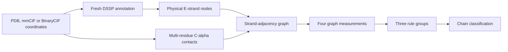

# Cooper-Beta

_A deterministic strand-adjacency graph classifier for beta-barrel-like protein chains._

Cooper-Beta 1.0.1 reads PDB, mmCIF, or BinaryCIF coordinates, regenerates secondary-structure annotations with DSSP, constructs one strand-adjacency graph per author chain, and reports a direct classification from three explicit rule groups. The package provides a command-line interface, a typed Python API, grouped evaluation utilities, and reproducible experiment scripts.

The `BARREL` class describes closure in the strand-adjacency graph. Functional annotation, membrane localization, and biological assembly interpretation can be added in downstream analyses.

---

## Contents

- [Installation](#installation)
- [Quick start](#quick-start)
- [Reading the output](#reading-the-output)
- [Algorithm](#algorithm)
- [Configuration](#configuration)
- [Python API](#python-api)
- [Evaluation and experiments](#evaluation-and-experiments)
- [Reproducibility](#reproducibility)
- [Troubleshooting](#troubleshooting)
- [Release notes](#release-notes)
- [License](#license)

## Installation

### Requirements

| Requirement | Supported version | Purpose |
| --- | --- | --- |
| Python | 3.10 or newer | Cooper-Beta runtime |
| DSSP | `mkdssp` 4.5.3 or newer | Fresh secondary-structure and ladder annotation |

Install DSSP and Cooper-Beta:

```bash
conda install -c conda-forge 'dssp>=4.5.3'
pip install cooper-beta
cooper-beta --check-env
```

A successful environment check prints the resolved Python executable, DSSP executable, and DSSP version.

Optional dependency groups provide additional workflows:

| Installation | Adds |
| --- | --- |
| `pip install 'cooper-beta[eval]'` | Evaluation tables and metrics |
| `pip install 'cooper-beta[scripts]'` | Dataset, annotation, and plotting utilities |
| `pip install 'cooper-beta[ml]'` | Grouped machine-learning experiments |
| `pip install 'cooper-beta[full]'` | Evaluation, scripts, plotting, and machine learning |

For a source checkout, create the locked development environment with:

```bash
uv tool install 'conda-lock==3.0.4'
bash scripts/setup_env.sh --name cooperbeta --dev
```

## Quick start

### Run the included examples

The repository contains two real predicted structures curated as positive examples. Author chain `A` in both files is classified as `BARREL` by the default rules.

```bash
cooper-beta examples \
  --workers 1 \
  --prepare-workers 1 \
  --out example_results.csv
```

| Example | Expected graph measurements | Expected class |
| --- | --- | --- |
| [`M4QT10.cif`](examples/M4QT10.cif) | 8 strands, 8 adjacencies, 8 cycle strands, rank 1 | `BARREL`, chain `A` |
| [`A0A2R4ALS6.cif`](examples/A0A2R4ALS6.cif) | 9 strands, 9 adjacencies, 8 cycle strands, rank 1 | `BARREL`, chain `A` |

[`examples/manifest.json`](examples/manifest.json) records the source, target chain, scientific label, sequence length, global pLDDT, and licence for each structure.

### Analyze one file or a directory

```bash
cooper-beta path/to/structures \
  --workers 8 \
  --prepare-workers 4 \
  --out results.csv
```

Directory discovery is recursive. Supported suffixes are `.pdb`, `.ent`, `.cif`, `.mmcif`, and `.bcif`, including their `.gz` variants. BinaryCIF is decoded to temporary mmCIF with its original categories, chains, residue identifiers, and model numbers preserved. The CLI writes:

- `results.csv`: one row per analyzed author chain
- `results.csv.manifest.json`: resolved settings, inputs, software environment, execution details, and output state

An existing output path is preserved by default. Select a new path or explicitly replace the existing result:

```bash
cooper-beta path/to/structures \
  --out results.csv \
  output.existing_artifact_policy=replace
```

## Reading the output

### Result classes

| `result` | Interpretation |
| --- | --- |
| `BARREL` | All three strand-graph rule groups passed |
| `NON_BARREL` | At least one rule condition failed |
| `ERROR` | Structure preparation or worker execution failed for the reported file or chain |

The `reason` field gives the passed-rule summary or the failed boundaries. `error_code` identifies failures such as structure parsing or DSSP execution. `result_stage` locates the outcome in `preparation`, `decision`, or `worker` processing.

The detection CLI exits with status `2` if any result row is `ERROR`, including batches with successful results. It writes the complete results CSV and, when enabled, the run manifest before exiting. A completed run containing only `BARREL` and `NON_BARREL` results exits with status `0`.

### Fixed CSV schema

The result CSV contains 14 columns in this order:

```text
filename,source_path,author_chain_id,result,result_stage,
dssp_unassigned_residue_count,strand_count,strand_adjacency_count,
cycle_strand_count,cycle_strand_fraction,cycle_rank,reason,error_code,degraded
```

| Field | Definition |
| --- | --- |
| `filename` | Input filename |
| `source_path` | Resolved input path used by the run |
| `author_chain_id` | Author-chain identifier from the selected model |
| `dssp_unassigned_residue_count` | Included polymer residues with a C-alpha coordinate and an incomplete finite `N/CA/C/O` backbone |
| `strand_count` | Number of physical DSSP `E` strands after beta-bulge merging |
| `strand_adjacency_count` | Number of undirected ladder- or contact-supported graph edges |
| `cycle_strand_count` | Strand count in the largest cycle-supported component |
| `cycle_strand_fraction` | `cycle_strand_count / strand_count`, or `0` for an empty graph |
| `cycle_rank` | Number of independent graph cycles |
| `degraded` | Indicates an error row produced under degraded preparation policy |

All counts are non-negative integers. `cycle_strand_fraction` is constrained to `[0, 1]` and is serialized consistently with its two counts.

## Algorithm

### Processing flow



### Structure preparation

The inference unit is one author chain in the configured coordinate model. Cooper-Beta retains author-chain identifiers, residue numbers, insertion codes, alternate locations, and declared polymer positions. Declared mmCIF polymer positions come from `label_seq_id`; when PDB `SEQRES` is available, positions are assigned by a unique alignment to that declaration. PDB files without `SEQRES`, including coordinate exports and predicted structures, use observed residue order. Author residue identifiers remain unchanged, and DSSP determines secondary structure from the coordinates. Observed residues do not constitute a complete sequence declaration for sequence-based benchmark methods.

For coordinate-only mmCIF files, each author chain is handled independently. ATOM amino acids seed the observed polymer. A modified amino acid stored as HETATM joins the polymer when it has a canonical backbone and a peptide connection to an included neighbor. The default maximum C-N distance is 1.8 Å. Temporary polymer categories allow DSSP to process single-chain and multichain coordinate exports.

Cooper-Beta regenerates DSSP annotations for the selected model and converts DSSP `E` ranges into strand segments.[^1] Segments covered by the same ladder side are merged into one physical strand, preserving beta bulges within a single node. A residue lacking a complete finite `N/CA/C/O` backbone remains part of the polymer record, receives `dssp_assignment_available=false`, and contributes to `dssp_unassigned_residue_count`.

### Strand-adjacency graph

For an author chain, let the undirected graph be $G=(V,E)$, where each node in $V$ is one physical strand. An edge is supported by either:

1. a DSSP ladder connecting two strands; or
2. at least two C-alpha contact pairs separated by at most 6.8 Å, with at least two distinct contacting residues on each strand.

The graph is deterministic for a fixed coordinate model, DSSP release, and resolved configuration. The contact distance and support counts are configurable under `strand_adjacency`.

### Graph measurements

Tarjan low-link traversal identifies bridge edges. Removing those bridges leaves the edges that participate in at least one cycle. Cooper-Beta reports:

1. **Strand adjacency count:** the number of undirected edges in the graph.
2. **Cycle strand count and fraction:** the number of strands in the largest connected component formed by non-bridge edges, reported together with its fraction of all graph strands. An empty graph has a fraction of zero.
3. **Cycle rank:** the number of independent cycles, calculated from the graph's edge, node, and connected-component counts.

Bridge detection and graph measurement scale linearly with the combined number of graph nodes and edges.

### Direct classification

The default classifier requires all three rule groups to pass at inclusive boundaries:

| Rule group | Default condition |
| --- | ---: |
| `strand_adjacency_count` | $A \ge 8$ |
| `cycle_strand_count / cycle_strand_fraction` | $S \ge 4$ and $F \ge 0.05$ |
| `cycle_rank` | $R \ge 1$ |

The decision is

$$
\texttt{BARREL} = (A\ge 8) \land (S\ge 4) \land (F\ge 0.05) \land (R\ge 1).
$$

A chain receives `NON_BARREL` when this conjunction is false. The four measurements remain available as continuous or count-valued features for learned classifiers.

## Configuration

All behavior-changing values are defined in [`config.py`](src/cooper_beta/config.py), with defaults in [`config.yaml`](src/cooper_beta/conf/config.yaml). CLI overrides use Hydra dot notation.

### Scientific defaults

| Setting | Default | Unit or meaning |
| --- | ---: | --- |
| `strand_adjacency.maximum_ca_distance_angstrom` | `6.8` | Å |
| `strand_adjacency.minimum_contact_pair_count` | `2` | C-alpha pairs |
| `strand_adjacency.minimum_contact_residue_count_per_strand` | `2` | Distinct residues per strand |
| `rules.strand_adjacency_count.minimum` | `8` | Graph edges |
| `rules.cycle_strand_count_fraction.minimum_count` | `4` | Cycle-supported strands |
| `rules.cycle_strand_count_fraction.minimum_fraction` | `0.05` | Fraction of graph strands |
| `rules.cycle_rank.minimum` | `1` | Independent cycles |

Override values directly on the command line:

```bash
cooper-beta path/to/structures \
  --out results.csv \
  runtime.native_threads_per_process=1 \
  strand_adjacency.maximum_ca_distance_angstrom=6.8 \
  rules.strand_adjacency_count.minimum=8 \
  rules.cycle_strand_count_fraction.minimum_count=4 \
  rules.cycle_strand_count_fraction.minimum_fraction=0.05 \
  rules.cycle_rank.minimum=1
```

Python mappings use the same keys:

```python
from cooper_beta import build_config

config = build_config(
    {
        "runtime.workers": 8,
        "runtime.prepare_workers": 4,
        "rules.cycle_rank.minimum": 1,
    }
)
```

Run `cooper-beta --help` for the complete interface, defaults, output behavior, and failure semantics.

## Python API

`detect` returns a typed `PipelineRunResult`. A CSV is written when `output` is supplied or `write_csv=True` is selected.

```python
from cooper_beta import detect

run = detect(
    "path/to/structures",
    workers=4,
    prepare_workers=2,
    output="results.csv",
)

print(run.result_counts)
for row in run.rows:
    print(
        row.filename,
        row.author_chain_id,
        row.result,
        row.strand_adjacency_count,
        row.cycle_strand_count,
        row.cycle_strand_fraction,
        row.cycle_rank,
    )
```

Common public interfaces are:

| Interface | Purpose |
| --- | --- |
| `detect(...)` | Run end-to-end chain classification |
| `build_config(...)` | Build and validate typed settings |
| `PipelineRunResult` | Access rows, inputs, output path, settings, and class counts |
| `DetectionResult` | Access one validated 14-column chain result |
| `ProteinLoader` | Parse structures and obtain per-chain preparation results |
| `StrandAdjacencyGraph` | Represent an immutable author-chain graph |
| `StrandGraphMeasurements` | Store the four measured graph values |

User-facing exceptions derive from `CooperBetaError`. Specific subclasses identify invalid configuration, unusable inputs, structure parsing, DSSP availability or execution, missing chains, changed inputs, and output publication failures.

## Evaluation and experiments

### Direct-classifier evaluation

Install the evaluation extra and provide separate positive and negative structure collections:

```bash
cooper-beta-eval \
  --positives path/to/positive_structures \
  --negatives path/to/negative_structures \
  --positive-manifest path/to/positive_truth.csv \
  --negative-manifest path/to/negative_truth.csv \
  --metric-level both \
  --metric-error-policy strict \
  --save-dir evaluation-results
```

Each target-chain manifest has four columns:

```text
filename,source_path,structure_sha256,target_author_chain_id
```

The evaluator reports target-chain metrics and any-positive-chain file metrics separately. Metrics with an undefined denominator are stored as null values with an accompanying `*_defined` field.

### Learned classifier and robustness analyses

[`scripts/nested_grouped_decision_experiment.py`](scripts/nested_grouped_decision_experiment.py) evaluates learned models from four features:

```text
strand_adjacency_count,cycle_strand_count,cycle_strand_fraction,cycle_rank
```

Family groups remain intact across held-out folds. [`scripts/perturbation_eval.py`](scripts/perturbation_eval.py) evaluates sensitivity to controlled coordinate noise. [`scripts/annotate_bfvd_candidates_blastp.py`](scripts/annotate_bfvd_candidates_blastp.py) supports sequence annotation of screened candidates.

Adapters for Foldseek, IsItABarrel, and PRED-TMBB2 are documented under [`external_methods`](external_methods). Their normalized outputs share explicit author-chain identifiers and can be compared with Cooper-Beta evaluation tables.

## Reproducibility

Cooper-Beta records the resolved configuration, discovered inputs, package version, DSSP executable and version, execution settings, and output state in the run manifest. Input and output ordering are deterministic. Preparation caching uses the same resolved scientific inputs that define the prepared payload.

The repository provides two locked environment routes:

- `uv.lock` for Python package resolution
- `environment.yml` and `conda-lock.yml` for Python plus DSSP

For comparative studies, define target chains and family groups before fitting models, retain complete held-out predictions, and report the Cooper-Beta version, DSSP version, resolved settings, grouping strategy, and metric policy. Dataset-construction scripts are available under [`data/scripts`](data/scripts).

## Troubleshooting

| Symptom | Likely cause | Action |
| --- | --- | --- |
| `DSSP: not found` | DSSP is absent from `PATH` | Install `dssp>=4.5.3` or set `runtime.dssp_bin_path=/path/to/mkdssp` |
| `Unsupported DSSP version` | The resolved DSSP predates 4.5.3 | Update DSSP and rerun `cooper-beta --check-env` |
| `OUTPUT_ARTIFACT_EXISTS` | The output CSV or manifest already exists | Choose a new `--out` path or set `output.existing_artifact_policy=replace` |
| `STRUCTURE_PARSE_FAILED` | The structure or declared polymer mapping is incomplete or ambiguous | Validate the selected model, author chains, `SEQRES`, and mmCIF polymer categories |
| `DSSP_FAILED` | DSSP could not annotate the prepared coordinate model | Inspect the reported DSSP message and validate the selected model with DSSP 4.5.3 or newer |
| Expected chain is absent | Label and author-chain identifiers differ | Inspect the structure's author-chain identifiers and the `author_chain_id` column |
| A large run uses too many processes | Worker counts exceed the desired resource allocation | Set `--workers`, `--prepare-workers`, and `runtime.native_threads_per_process` explicitly |

For a minimal diagnostic, run one structure with one worker and preserve the error message:

```bash
cooper-beta path/to/structure.cif \
  --workers 1 \
  --prepare-workers 1 \
  --out diagnostic.csv
```

## Release notes

### 1.0.1

- Adds BinaryCIF (`.bcif`, `.bcif.gz`) through the RCSB `mmcif` reader, preserving polymer declarations and atom identities
- Includes `.ent` and `.ent.gz` in default input discovery
- Supports coordinate-only PDB without `SEQRES` and multichain coordinate-only mmCIF
- Includes the configured peptide-bond distance in preparation-cache reuse decisions
- Returns exit status `2` when a detection batch contains any `ERROR` row, preserving the complete results CSV and run manifest

### 1.0.0

Initial public release.

- Builds physical strands from fresh DSSP `E` ranges and merges beta-bulge fragments assigned to one ladder side
- Combines DSSP ladder adjacencies with multi-residue C-alpha contacts
- Measures `strand_adjacency_count`, `cycle_strand_count`, `cycle_strand_fraction`, and `cycle_rank`
- Applies three configurable direct-classifier rule groups
- Produces a fixed 14-column chain result and a bound run manifest
- Supports PDB, mmCIF, and configured gzip-compressed inputs
- Provides typed configuration, grouped evaluation tools, locked environments, and two curated positive examples

## License

Cooper-Beta source code is released under the [MIT License](LICENSE). The files in `examples/` retain the [CC BY 4.0](https://creativecommons.org/licenses/by/4.0/) licence recorded in [`examples/manifest.json`](examples/manifest.json).

## References

[^1]: Van Ginkel, G. et al. (2025). "DSSP 4: FAIR annotation of protein secondary structure." _Protein Science_. https://doi.org/10.1002/pro.70208
